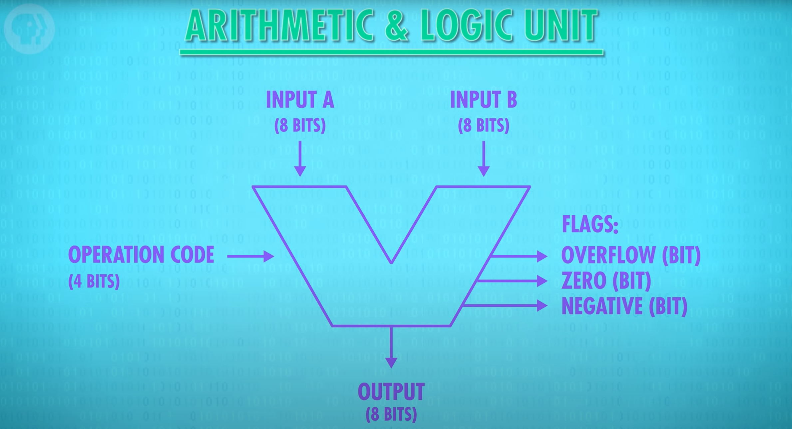

# How Computers Calculate - ALU

- ALU = Arithmetic and Logic Unit (2 units in 1)
	- Mathematical brain of the computer
	- Does ALL computation
	- Intel 74181 - most famous ALU ever (1970)
		- First to fit inside a chip
		- Only handled 4-bit inputs
		- 70 logic gates
		- No multiplication or division
	- ALU is 2 units in 1
		- Arithmetic unit
			- All numerical operations (add, sub, etc)
			- Incremental operations
			- 8 Supported Operations
				1. ADD - A and B are summed
				2. ADD with CARRY - A and B and a Carry-In bit are all summed
				3. SUBTRACT - B is subtracted from A (or vice-versa)
				4. SUBTRACT with BORROW - B is subtracted from A (or vice-versa) with borrow (carry-in)
				5. NEGATE - A is subtracted from zero, flipping its sign (from - to +, or + to -)
				6. INCREMENT - Add 1 to A
				7. DECREMENT - Subtract 1 from A
				8. PASS THROUGH - All bits of A are passed through unmodified
			- Simple ALUs use a series of additions and subtractions for multiplication and division
				- Found in remotes, microwave and other small appliances and electronics
		- Logic unit
			- Logical operations like AND, OR and NOT
			- Simple numerical tests (pos/neg sign checks)
- Building a simple 74184 ALU circuit with simple boolean logic
	- Instead of focusing on how to build the ALU with transistors (the true building blocks), logic gates can be used to add a layer of abstraction that removes some of the complexity
	- Building the Arithmetic Unit
		- Half Adder - simplest adding circuit
			- Adds 2 binary digits and returns the sum (each is a single bit)
				- 2 inputs (A, B)
				- 1 output (A + B)
				- 4 possible combinations
					- 0 + 0 = 0
					- 1 + 0 = 1
					- 0 + 1 = 1
					- 1 + 1 = 2 or 10 in binary (special case because we need to carry the 1 in binary)
						- Requires to outputs
							- The sum
							- The carry
			-  Uses 2 logic gates (XOR and AND)
		- Full Adder
			- A new layer of abstraction
			- Adds 3 binary digits and returns a carry and a sum
				- 3 inputs (A, B, C)
				- 2 outputs for A+B+C  (carry, sum)
			- Requires 2 half adders and an OR gate
				- A and B are inputs of the first half adder
				- The sum (A + B) becomes A in the new half adder and C will be B
				- The carries from the 2 adders are inputs of the OR gate and the sum is the output form the 2nd half adder
		- 8-Bit Ripple Carry Adder 
			- Starts with a half adder
			- Each sum is an output from s0 to s7
			- Each carry becomes the A input of the Full Adder for the next addition
			- The result is 8 sums (s0 to s7) and one possible carry
				- If a carry results, then there is an overflow
				- Overflow - result of addition is too large to be represented by the number of bits being used
				- Must add more Full Adders to prevent overflow
		- Carry-Look-Ahead Adders - used by modern computers
			- Needed because the addition of more Full Adders requires more time for electrons to pass through and can slow down speed
			- Adds binary numbers faster
	- How engineers represent 8-Bit Adders
		- Using the letter "V"
		- 